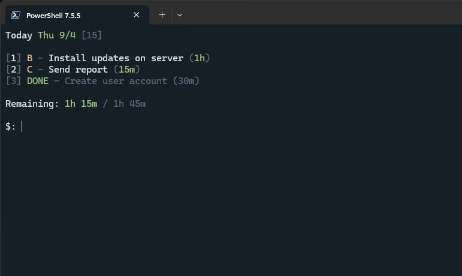

# WhatToDo
A PowerShell to-do list module that uses the **todo.txt** format (https://github.com/todotxt/todo.txt).



## What can this module do?
**WhatToDo** allows you to have daily to-do lists in the PowerShell terminal. Each day has its own list and you can easily push tasks to other days.

### Features
- Fast and easy task management (creation, completion, removal, pushing to other days).
- Easy switching between different daily task lists (for any day).
- Simple and effective interface that shows date and week number for the selected day, with estimation time for the tasks.
- Recurring tasks that automatically add themselves to the specified days in the config (based on year, month, day, day-of-week, week number, etc).

----

## How do I get started?

### Create required folders and copy the module files
1. Create a folder called `WhatToDo` in your PowerShell modules folder. You can find all your module folder paths by running the command `$env:PSModulePath -split ';'` in your PowerShell terminal. The module path for PowerShell 7 (Core) on Windows could be something like `C:\Users\Username\Documents\PowerShell\Modules`.
2. Download the module files from this repository (`Modules/WhatToDo.psd1` and `Modules/WhatToDo.psm1`) and place them in the newly created module folder (`C:\Users\Username\Documents\PowerShell\Modules\WhatToDo`).
3. Create a new folder that will store the configuration and task list files. This folder can exist wherever you want, but you'll need to refer to it when you want to use the module functions.

### Import the module in your PowerShell profile
Your PowerShell profile runs every time you open a new terminal session.
- Edit your PowerShell profile in your favorite editor. Add `Import-Module -Name 'path\to\WhatToDo\WhatToDo.psm1'` anywhere in the profile, then reload your profile or start a new session. To see which file path your PowerShell profile has, run `$PROFILE` in the terminal.

### Initialize the module to create required files
- Run `Initialize-WhatToDo -DirectoryPath 'path\to\WhatToDo'`. Set the **DirectoryPath** value to the directory that should store your configuration and task list files.

### Run the module
- Run `Start-WhatToDo -ConfigurationPath 'path\to\WhatToDo\WhatToDo-Config.psd1'`. Set the **ConfigurationPath** value to the configuration file that was created in the WhatToDo directory.

### Find all available commands (with examples)
- In the WhatToDo prompt (after running the Start-WhatTodo command), type **help** and press Enter to show all available commands.

### Configure recurring tasks
- Recurring tasks can be configured in the configuration file `WhatToDo-Config.psd1`.

### Launch the task list
```powershell
Start-WhatToDo -ConfigurationPath 'path\to\WhatToDo\WhatToDo-Config.psd1'
```

----

## Bonus 1: Set default parameter value to auto-include configuration file for Start-WhatToDo
This will allow you to launch the task list without specifying the path to the configuration file.

1. Edit your PowerShell profile (`$PROFILE`).
1. Add the following default parameter value somewhere in the profile. Point it to the correct file path.

```powershell
$PSDefaultParameterValues['Start-WhatToDo:ConfigurationPath'] = 'path\to\WhatToDo\WhatToDo-Config.psd1'
```

Now you can run `Start-WhatToDo` without the **ConfigurationPath** parameter.
```powershell
Start-WhatToDo
```

## Bonus 2: Create shortcut to standalone session
Create a shortcut in Windows to launch WhatToDo in a standalone session. This will allow the **Start-WhatToDo** function to act as a standalone application.

- Target: `C:\Windows\System32\conhost.exe pwsh.exe -Command "Start-WhatToDo -ConfigurationPath 'path\to\WhatToDo\WhatToDo-Config.psd1'"`

----

## A few command examples
Add a task with the description "Configure new server", with **A** priority and estimation time of two hours.
```
add a 2h Configure new server
```

Mark the number 1 task in the list as completed.
```
done 1
```

Remove the number 3 task from the list.
```
remove 3
```

Push the number 2 task to the next day.
```
move 2
```

Load the next day's list.
```
load +1
```